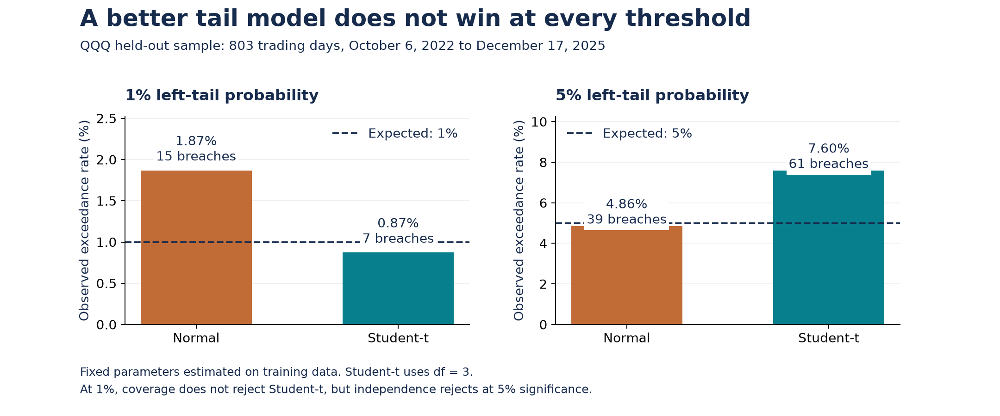
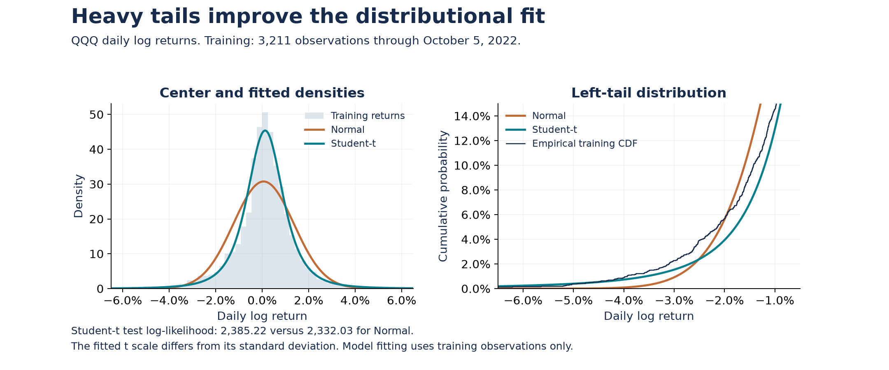

# Non-Gaussian Market Returns

**Normal versus Student-t models for QQQ: likelihood estimation, held-out evaluation, and tail-risk calibration.**

**Lyla Saigal & Aaryaman Jaising** · ECON H324, Haverford College · Fall 2025

[](https://github.com/Ar4yu/Non_gaussian_market_returns/actions/workflows/ci.yml)

**[Read the original paper](docs/final-paper.pdf)** · **[Methods and interpretation notes](docs/METHODS.md)** · **[Present the project](docs/PRESENTER_NOTES.md)** · **[Data provenance](docs/DATA.md)**



## Research question

Does a heavy-tailed distribution explain daily equity returns better than a Gaussian benchmark, and does the improvement translate into better risk calibration?

Our group compared Normal and Student-t distributions using maximum likelihood on QQQ daily log returns. We selected Student-t degrees of freedom on a training-only integer grid, then evaluated likelihood and Value at Risk (VaR) on a chronological holdout. The result is nuanced: Student-t improves likelihood and 1% coverage, while Normal calibrates the 5% threshold better.

## Key results

The frozen sample contains **3,211 training returns** (January 5, 2010–October 5, 2022) and **803 test returns** (October 6, 2022–December 17, 2025).

| Distribution | Training log-likelihood | Test log-likelihood | Training AIC | Training BIC |
|---|---:|---:|---:|---:|
| Normal | 9,394.88 | 2,332.03 | −18,785.77 | −18,773.62 |
| Student-t, df = 3 | 9,741.49 | 2,385.22 | −19,476.99 | −19,458.76 |

Higher likelihood and lower AIC/BIC favor Student-t in this sample. Its held-out log-likelihood is **53.20 higher**. These are density-model results, not strategy returns or investment-performance claims.

| Tail probability | Model | Breaches / 803 | Observed rate | Coverage p-value | Independence p-value | Joint p-value |
|---|---|---:|---:|---:|---:|---:|
| 1% | Normal | 15 | 1.87% | 0.0274 | 0.2783 | 0.0487 |
| 1% | Student-t | 7 | 0.87% | 0.7088 | 0.0460 | 0.1275 |
| 5% | Normal | 39 | 4.86% | 0.8516 | 0.4338 | 0.7234 |
| 5% | Student-t | 61 | 7.60% | 0.0017 | 0.4846 | 0.0055 |

At a 5% significance threshold, Student-t is not rejected by the 1% unconditional or joint coverage tests, **but its independence test rejects**. At the 5% tail, it produces too many breaches: its threshold is insufficiently conservative. The [interpretation notes](docs/METHODS.md) explicitly correct the opposite wording in the original paper, which remains unchanged as the submitted group artifact.



## Reproduce offline

Python 3.11 or newer. The committed historical data are sufficient; no credentials, live data request, or market connection is needed.

```bash
git clone https://github.com/Ar4yu/Non_gaussian_market_returns.git
cd Non_gaussian_market_returns
python3 -m venv .venv
source .venv/bin/activate
python -m pip install -r requirements.txt
python scripts/reproduce.py
python -m unittest discover -s tests -v
python scripts/build_figures.py
```

`reproduce.py` verifies data hashes and reconstructs log returns from prices, refits both distributions, reruns fixed and historical rolling VaR, and compares **four result tables** with the archived results. New outputs go to `reproduced/`, leaving the original `outputs/` intact. The full grid searches df = 1 through 150. Small optimizer differences across SciPy versions are allowed by explicit numeric tolerances.

`build_figures.py` regenerates the two README figures from the frozen data and saved result tables. Run reproduction first to verify those tables independently.

## What the code demonstrates

- Closed-form Gaussian MLE and constrained numerical optimization of Student-t location and scale.
- A chronological split and training-only degrees-of-freedom selection.
- Likelihood evaluation, AIC/BIC, and parametric left-tail quantiles.
- Kupiec coverage and Christoffersen independence/conditional-coverage tests.
- Reproducible historical-data checks and isolated output generation.

## Repository guide

| Path | Contents |
|---|---|
| `docs/final-paper.pdf` | Original 10-page paper by Lyla Saigal and Aaryaman Jaising |
| `analysis.py` | Normal MLE and Student-t grid search |
| `backtest.py` | Fixed-parameter VaR and coverage tests |
| `rolling_var.py` | Historical rolling plug-in sensitivity experiment |
| `scripts/reproduce.py` | Offline end-to-end reproduction and table comparison |
| `scripts/build_figures.py` | README figure generation |
| `tests/test_research.py` | Regression tests for data and statistical calculations |
| `data_processed/` | Frozen adjusted prices, returns, and checksum manifest |
| `outputs/` | Original paper result tables and figures |
| `visualizations/` | Original exploratory figures |
| `preprocess.py` | Optional historical-period data refresh into a separate directory |

## Scope and limitations

The main comparison is static and distributional. It does not model changing volatility, transaction costs, portfolio allocation, or trading execution. QQQ is the empirical focus, not a stand-in for every market. The five-ticker dataset also includes SPY, AAPL, JPM, and XOM.

The **rolling t experiment is a historical plug-in heuristic**: it uses each 504-day window's sample mean and standard deviation directly as t(3) location and scale. It does not refit Student-t MLE or match the Normal variance. Its two breaches versus 16 for Normal therefore should not be presented as a controlled comparison of fitted distributions. See [methods](docs/METHODS.md).

The original PDF is preserved byte-for-byte. September 2026 portfolio additions include the README, interpretation notes, figures, reproducibility runner, tests, CI, and a correction to an unused generic quantile helper. The fixed-parameter paper results are unchanged. Authorship of the research remains shared; the portfolio update does not assign individual ownership of components.
